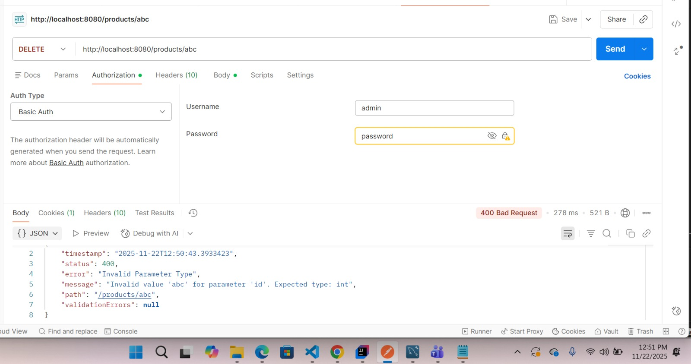
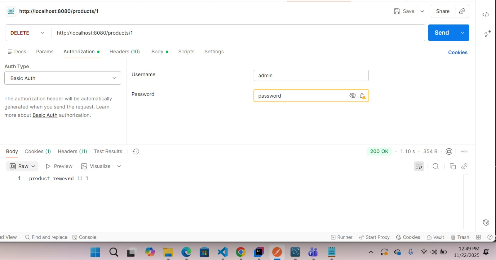
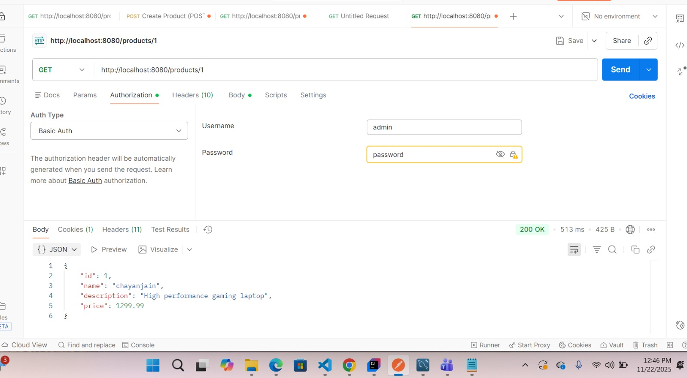
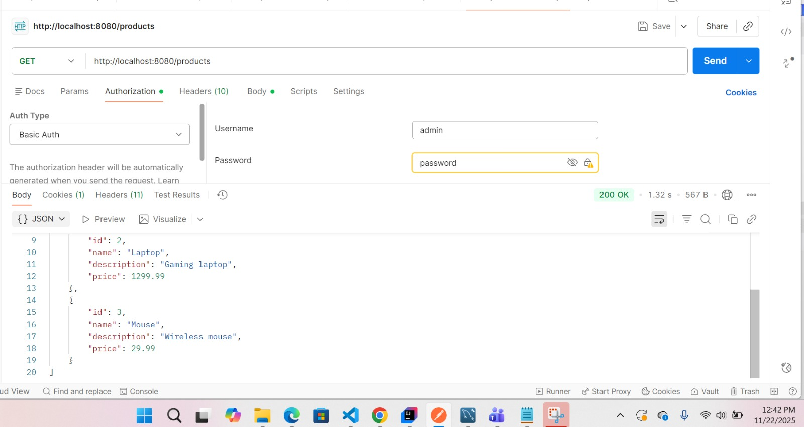
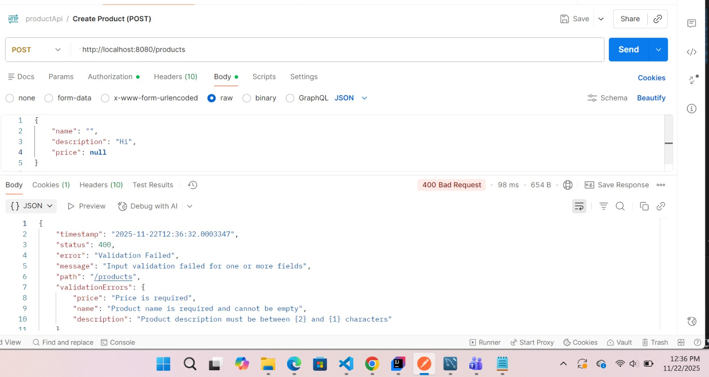
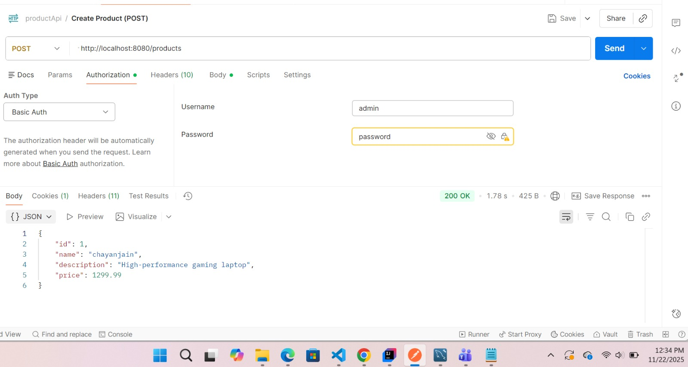
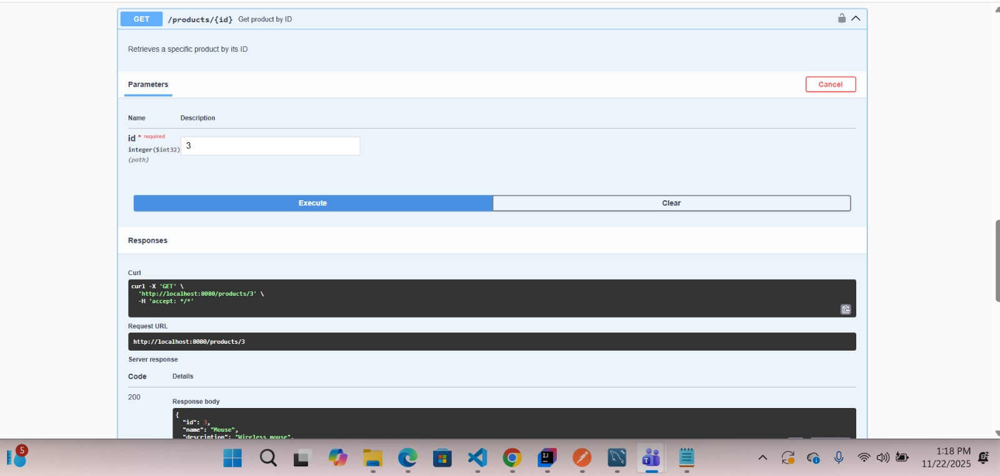
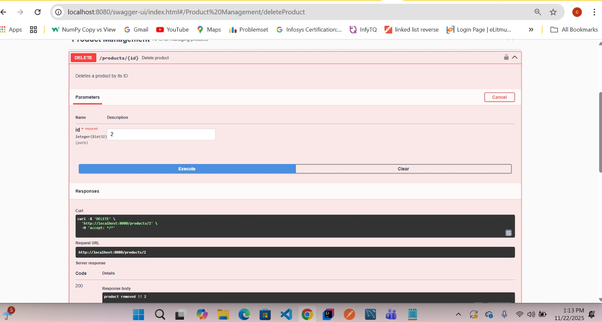

# Product Management CRUD API

A RESTful API built with Spring Boot that provides complete CRUD operations for product management with authentication, validation, and comprehensive error handling.

## 🚀 Features

- **Complete CRUD Operations**: Create, Read, Update, Delete products
- **Input Validation**: Bean Validation (JSR 380) with custom error messages
- **Authentication**: Basic HTTP authentication
- **API Documentation**: Interactive Swagger UI
- **Global Exception Handling**: Centralized error management
- **Database Integration**: MySQL with JPA/Hibernate
- **Custom Error Messages**: Internationalized validation messages

## 🛠️ Technology Stack

- **Java**: 17
- **Spring Boot**: 3.5.7
- **Spring Data JPA**: Database operations
- **Spring Security**: Authentication
- **Spring Validation**: Input validation
- **MySQL**: Database
- **Swagger/OpenAPI 3**: API documentation
- **Lombok**: Boilerplate code reduction
- **Maven**: Build tool

## 📋 Prerequisites

Before running this application, ensure you have:

1. **Java 17** or higher installed
2. **MySQL 8.0+** installed and running
3. **Git** for cloning the repository

**Note**: Maven installation is **NOT required** - this project includes Maven Wrapper!

### Java Installation
```bash
# Check if Java is installed
java -version

# If not installed, download from:
# https://www.oracle.com/java/technologies/javase/jdk17-archive-downloads.html
# or use OpenJDK: https://openjdk.org/projects/jdk/17/
```

### MySQL Installation
```bash
# Download MySQL from: https://dev.mysql.com/downloads/mysql/
# Or use MySQL Workbench for GUI: https://dev.mysql.com/downloads/workbench/
```

## 🏗️ Project Structure

```
productmgmnt/
├── src/
│   ├── main/
│   │   ├── java/com/crudapi/
│   │   │   ├── advice/
│   │   │   │   └── GlobalExceptionHandler.java    # Global error handling
│   │   │   ├── config/
│   │   │   │   ├── OpenApiConfig.java             # Swagger configuration
│   │   │   │   └── SecurityConfig.java            # Security configuration
│   │   │   ├── controller/
│   │   │   │   └── ProductController.java         # REST endpoints
│   │   │   ├── dto/
│   │   │   │   └── ErrorResponse.java             # Error response model
│   │   │   ├── entity/
│   │   │   │   └── Product.java                   # JPA entity
│   │   │   ├── exception/
│   │   │   │   └── RecordNotFoundException.java   # Custom exception
│   │   │   ├── repository/
│   │   │   │   └── ProductRepository.java         # Data access layer
│   │   │   ├── service/
│   │   │   │   └── ProductService.java            # Business logic
│   │   │   └── ProductmgmntApplication.java       # Main application
│   │   └── resources/
│   │       ├── application.properties             # Configuration
│   │       └── messages.properties                # Validation messages
│   └── test/
├── pom.xml                                        # Maven dependencies
└── README.md
└── images

```

## Quickstart

1. Clone the repository
2. Open the project in your IDE: IntelliJ IDEA
3. Configure the database connection and security configurations in `application.properties` file (check the [Database](#database-setup) section below for more info)
4. Run the project (by running the `main` method in `ProductManagementApiApplication.java`)
5. Verify Installation: Open http://localhost:8080/ in your browser!
- Application will start on `http://localhost:8080`
- Swagger UI: http://localhost:8080/swagger-ui.html
- API Docs: http://localhost:8080/v3/api-docs

## ⚙️ Configuration

### Database Setup

1. **Create MySQL Database**:
```sql
CREATE DATABASE chayandb;
```

2. **Update Database Configuration** in `application.properties`:
```properties
# Database Configuration
spring.datasource.url=jdbc:mysql://localhost:3306/chayandb?createDatabaseIfNotExist=true
spring.datasource.username=root
spring.datasource.password=your_password_here
spring.datasource.driver-class-name=com.mysql.cj.jdbc.Driver

# JPA/Hibernate Configuration
spring.jpa.hibernate.ddl-auto=update
spring.jpa.show-sql=true
spring.jpa.properties.hibernate.dialect=org.hibernate.dialect.MySQLDialect
```

3. **Update Security Credentials**:
```properties
# Security Configuration
spring.security.user.name=admin
spring.security.user.password=password
spring.security.user.roles=USER
```

## 📚 API Endpoints

### Authentication
All endpoints require Basic Authentication:
- **Username**: `admin`
- **Password**: `password`

### Product Operations

| Method | Endpoint | Description | Request Body |
|--------|----------|-------------|--------------|
| GET | `/products` | Get all products | None |
| GET | `/products/{id}` | Get product by ID | None |
| POST | `/products` | Create new product | Product JSON |
| PUT | `/products/{id}` | Update product | Product JSON |
| DELETE | `/products/{id}` | Delete product | None |
| POST | `/addProducts` | Create multiple products | Array of Products |

### Product Model
```json
{
  "id": 1,
  "name": "Product Name",
  "description": "Product Description",
  "price": 99.99
}
```

### Validation Rules
- **Name**: Required, 2-100 characters
- **Description**: Required, 5-500 characters
- **Price**: Required, minimum 0.01

### Controller
- control the endpoint
### Models
- represent data as entity and relationship among them.
### View
- receive data from controller and show with frontend.


## 🧪 Testing the API

### Using cURL

1. **Create a Product**:
```bash
curl -X POST http://localhost:8080/products \
  -u admin:password \
  -H "Content-Type: application/json" \
  -d '{
    "name": "Laptop",
    "description": "High-performance laptop for gaming",
    "price": 1299.99
  }'
```

2. **Get All Products**:
```bash
curl -X GET http://localhost:8080/products \
  -u admin:password
```

3. **Get Product by ID**:
```bash
curl -X GET http://localhost:8080/products/1 \
  -u admin:password
```

4. **Update Product**:
```bash
curl -X PUT http://localhost:8080/products/1 \
  -u admin:password \
  -H "Content-Type: application/json" \
  -d '{
    "name": "Gaming Laptop",
    "description": "Updated high-performance gaming laptop",
    "price": 1399.99
  }'
```

5. **Delete Product**:
```bash
curl -X DELETE http://localhost:8080/products/1 \
  -u admin:password
```

### Using Swagger UI

1. Navigate to `http://localhost:8080/swagger-ui.html`
2. Click "Authorize" and enter credentials (`admin`/`password`)
3. Test endpoints interactively


## 📊 Error Handling

The API provides comprehensive error responses:

### Validation Error Example
```json
{
  "status": 400,
  "error": "Validation Failed",
  "message": "Input validation failed for one or more fields",
  "path": "/products",
  "validationErrors": {
    "name": "Product name is required and cannot be empty",
    "price": "Price must be greater than 0.01"
  }
}
```

### Not Found Error Example
```json
{
  "status": 404,
  "error": "Resource Not Found",
  "message": "Product not found with id: 999",
  "path": "/products/999"
}
```

## 🔒 Security

- **Basic Authentication**: All endpoints protected
- **Input Validation**: Prevents malicious data
- **SQL Injection Protection**: JPA/Hibernate parameterized queries
- **Error Information**: Sanitized error responses

## 📈 Monitoring & Logging

- **SQL Logging**: Enabled in development (`spring.jpa.show-sql=true`)
- **Application Logs**: Standard Spring Boot logging
- **Health Check**: Available at `/actuator/health` (if actuator is enabled)

## Spring Boot

For any information about Spring Boot, here are some useful links!

### Reference Documentation
For further reference, please consider the following sections:

* [Official Apache Maven documentation](https://maven.apache.org/guides/index.html)
* [Spring Boot Maven Plugin Reference Guide](https://docs.spring.io/spring-boot/docs/2.6.4/maven-plugin/reference/html/)
* [Create an OCI image](https://docs.spring.io/spring-boot/docs/2.6.4/maven-plugin/reference/html/#build-image)
* [Spring Web](https://docs.spring.io/spring-boot/docs/2.6.4/reference/htmlsingle/#boot-features-developing-web-applications)

### Guides
The following guides illustrate how to use some features concretely:

* [Building a RESTful Web Service](https://spring.io/guides/gs/rest-service/)
* [Serving Web Content with Spring MVC](https://spring.io/guides/gs/serving-web-content/)
* [Building REST services with Spring](https://spring.io/guides/tutorials/bookmarks/)

## Preview


















**Happy Coding! 🎉**